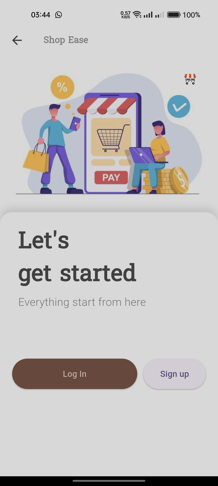
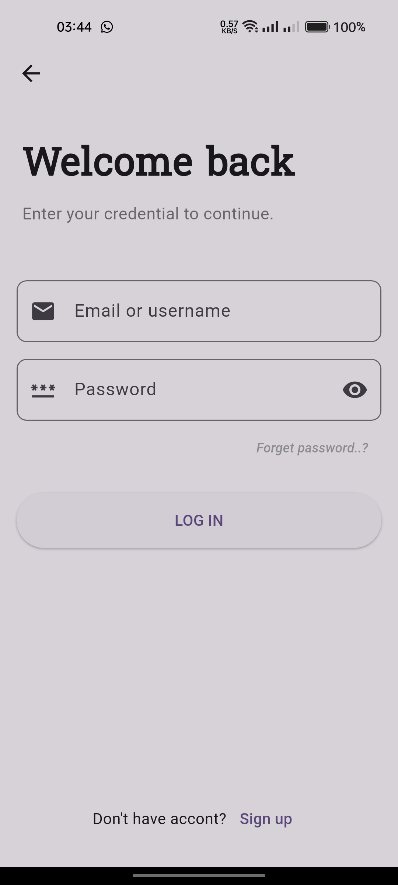
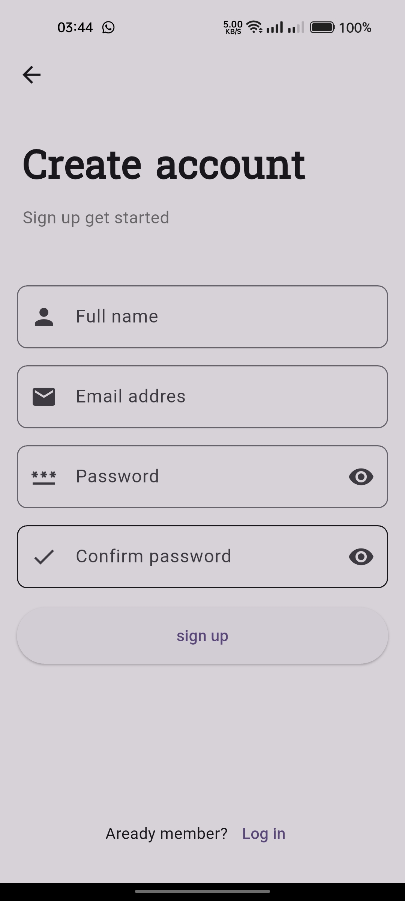
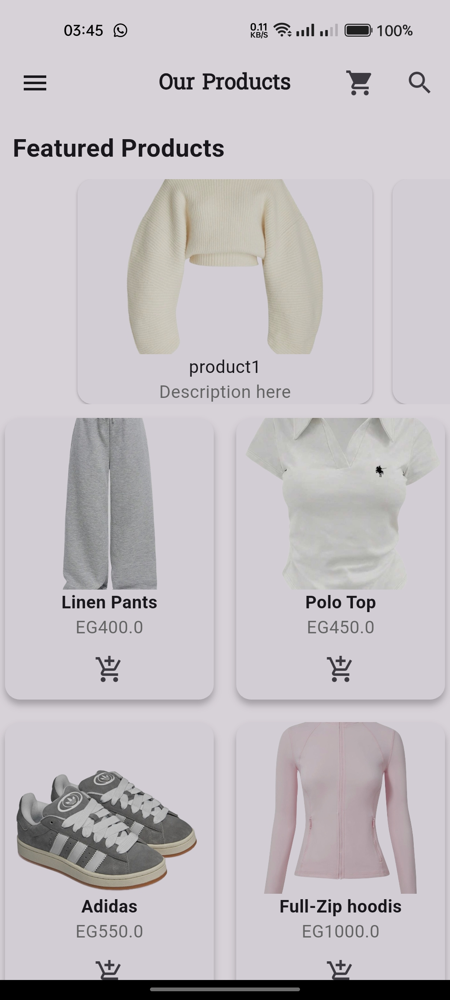
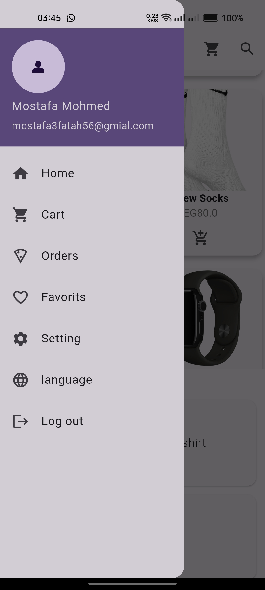

# Shopping App

A new Flutter project.

## Overview
A simple Flutter shopping application with product showcase, hot offers, and multi-language support.

## Features
- Featured products (PageView)
- Product grid with add-to-cart
- Hot offers (ListView)
- Sign up & login forms
- Arabic/English localization
- Custom app icon

## Getting Started
1. Clone the repository
2. Run `flutter pub get`
3. Run the app using `flutter run`

## 🖼️ Screenshots
### Welcome Screen

### 🔑 Login

### ✍️ Sign Up

### 🏠 Home Screen

This project is a starting point for a Flutter application.

A few resources to get you started if this is your first Flutter project:

- [Lab: Write your first Flutter app](https://docs.flutter.dev/get-started/codelab)
- [Cookbook: Useful Flutter samples](https://docs.flutter.dev/cookbook)

For help getting started with Flutter development, view the
[online documentation](https://docs.flutter.dev/), which offers tutorials,
samples, guidance on mobile development, and a full API reference.
